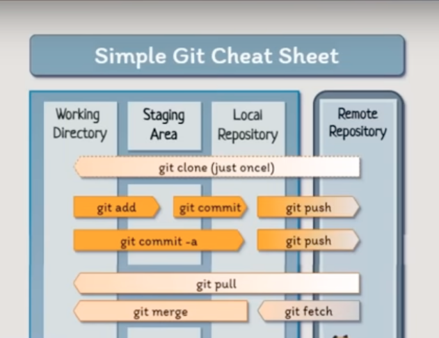
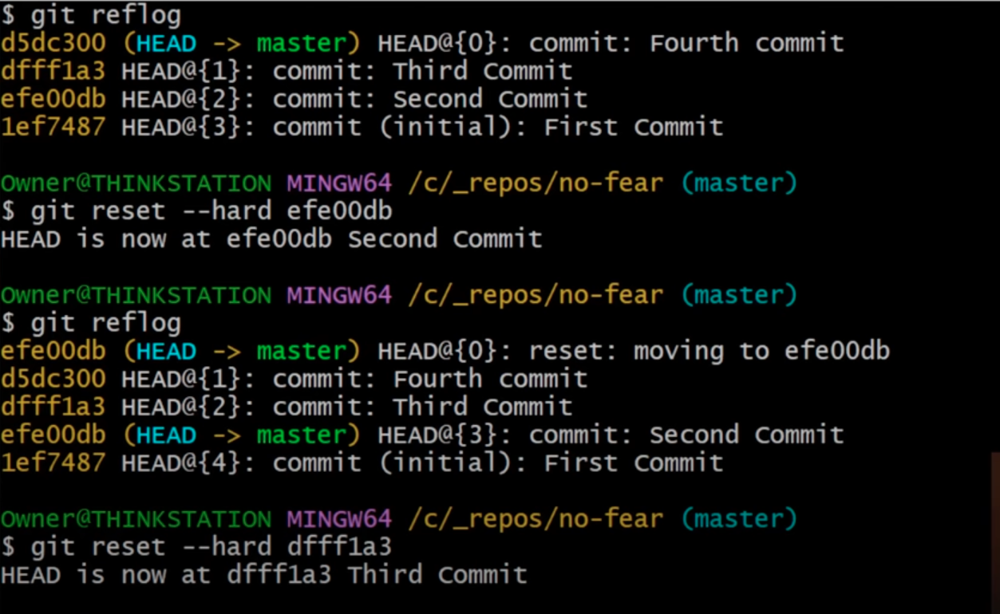

# Git and GitHub

# Git and GitHub differences

| **Feature** | **Git** | **GitHub** |
| --- | --- | --- |
| Type | Version Control tool | Cloud Platform / Hosting service |
| Runs on | Your local machine (command line) | Web (cloud), but supports local interaction |
| Purpose | 1) Track and manage code changes
2) Share and collaborate with others (locally or remotely)
3) Branch the code | 1) Share and collaborate on Git repositories in cloud
2) Built-in security features
3) Provides Workflow
4) Provides free hosting |
| Requires Git? | — | ✅ Yes, Git is the engine |
| Internet needed? | ❌ No (works offline) | ✅ Yes (to push/pull) |
| Example usage | `git commit`, `git push` | Creating Pull Requests, Issues, CI/CD |

# Simple Git Workflow and commands



## git clone

`git clone` is a **Git command** used to **copy a remote repository** (like one on GitHub) to your **local machine**.

---

**📌 Basic Syntax:**

```bash

git clone <repository-url>
example: git clone https://github.com/octocat/Hello-World.git

```

---

This command will:

1. **Download** the entire repository (code, history, branches, etc.).
2. **Create a folder** called `Hello-World` on your computer.
3. Set the GitHub repo as the **origin** (remote source) so you can push/pull later.

---

**💡 Common Options:**

| Option | Description |
| --- | --- |
| `--depth 1` | Clone only the latest commit (faster, less history). |
| `-b branch_name` | Clone a specific branch instead of the default. |

Example: to clone only branch called dev from the repo

```bash

git clone -b dev https://github.com/octocat/Hello-World.git

```

## git status

`git status` is a Git command that shows you the **current state** of your working directory and staging area.

---

**🧾 What It Tells You:**

1. Which files have been changed
2. Which files are staged (ready to commit)
3. Which files are not staged
4. Which files are untracked (new files Git doesn’t know yet)
5. Which branch you're on

---

**📌 Basic Usage:**

```bash

git status

```

---

**🧪 Example Output:**

```bash

On branch main
Your branch is up to date with 'origin/main'.

Changes not staged for commit:
  (use "git add <file>..." to update what will be committed)
    modified:   index.html

Untracked files:
  (use "git add <file>..." to include in what will be committed)
    newfile.txt

no changes added to commit (use "git add" and/or "git commit -a")

```

## git add

`git add` is a Git command used to **stage** changes. It tells Git:

**“I want to include these changes in the next commit.”**

---

**🔄 How Git Works (in 3 zones):**

1. **Working Directory** — where you edit files
2. **Staging Area** — where files are prepared (via `git add`)
3. **Repository** — where commits are saved (via `git commit`)

---

**📌 Basic Syntax:**

```bash

git add <filename>

```

---

**🧪 Examples:**

```bash

git add index.html

```

✅ Stages one file.

```bash

git add .

```

✅ Stages **all modified and new** files in the current directory and below.

```bash

git add -A

```

✅ Stages **all changes**, including deleted files.

```bash

git add *.js

```

✅ Stages all `.js` files in the current folder.

---

**🔍 Before & After `git add`:**

- **Before**:
    
    `git status` shows the file as **"not staged"** or **"untracked"**.
    
- **After**:
    
    `git status` will show it as **"Changes to be committed"**.
    

---

**🧠 Tip:**

`git add` doesn’t save your changes permanently — it just queues them up. You still need to run `git commit` to finalize them.

## git commit

The command `git commit` is used to **save changes** to your local repository.

Think of it like taking a **snapshot** of your project at a certain point in time.

But before you commit, you need to **stage your changes** with `git add`.

**✅ Basic Workflow**

```bash

git add <filename>    # Stage the file
git commit -m "Your message"  # Save a snapshot with a message

```

---

## **git config**

`git config` is the Git command used to **set and view configuration options**, such as your **name**, **email**, **editor**, and more. These settings help Git know how to behave and how to identify you.

---

**🧭 Three Levels of Configuration:**

| Level | Description | Example Location |
| --- | --- | --- |
| `--system` | System-wide settings (all users) | `/etc/gitconfig` |
| `--global` | User-wide settings (your user only) | `~/.gitconfig` |
| *(default)* | Project-specific (in the repo) | `.git/config` inside the repo |

---

**🧪 Common Examples**

**✅ 1. Set your name and email (global):**

```bash
git config --global user.name "Chaw Theingi"
git config --global user.email "chaw@example.com"

```

**✅ 2. Set default text editor:**

```bash

git config --global core.editor "code --wait"

```

**✅ 3. Check current settings:**

```bash
git config --list

```

Or for global only:

```bash

git config --global --list

```

**✅ 4. See a specific setting:**

```bash

git config user.name

```

---

**🔧 Project-Specific Example**

If you're in a Git repo and want to set a different email just for that project:

```bash

git config user.email "project@example.com"

```

This will write to `.git/config` in that repo only.

Other Git Config Files (for reference):

| Scope | Location | Command to View |
| --- | --- | --- |
| Local | `.git/config` | `cat .git/config` |
| Global | `~/.gitconfig` | `cat ~/.gitconfig` |
| System | `/etc/gitconfig` (may require sudo) | `cat /etc/gitconfig` |

## git log

It shows the **detailed commit history** of your current branch in **reverse chronological order** (most recent commit first).

## git push

The `git push` command is used to **upload your local Git commits to a remote repository** (like GitHub, GitLab, or Bitbucket).

**Typical Use Case**

You make some commits locally and want to **share them** (or back them up) to GitHub:

```bash

git push origin <branch-name>
git push origin main

```

**Breakdown:**

- `origin` = the **remote name** (default name for GitHub repo)
- `main` = the **branch name**

---

**📌 If you're on `main`, you can just run:**

```bash
git push

```

...and Git will **automatically push** to `origin/main` if it's already set up (after the first push).

## git pull

**What Is `git pull`?**

The `git pull` command is used to **fetch and merge changes from a remote repository** into your current local branch.

It's like saying:

> “Get the latest version of this project from GitHub and automatically add it to what I’m working on.”
> 

---

**✅ Basic Command**

```bash

git pull

```

**🧠 What Happens Behind the Scenes:**

`git pull` = `git fetch` + `git merge`

1. `git fetch` → Downloads the latest commits from the remote branch
2. `git merge` → Merges those commits into your current local branch

---

**🔍 Example**

```bash
git pull origin main

```

**Meaning:**

- `origin` = your **remote repo** (usually GitHub)
- `main` = the **branch** you're pulling updates from

---

**📝 Output Example**

```
bash
CopyEdit
remote: Enumerating objects: 3, done.
remote: Counting objects: 100% (3/3), done.
Unpacking objects: 100% (3/3), done.
From github.com:yourname/project
   3edcc47..0927ba4  main       -> origin/main
Updating 3edcc47..0927ba4
Fast-forward
 README.md | 2 +-
 1 file changed, 1 insertion(+), 1 deletion(-)

```

This shows:

- What changed
- Which files were updated
- That your branch has moved forward ("Fast-forward")

## git reset —hard <commit-number>

🧨 What Does `git reset --hard` Do?

```bash
git reset --hard <commit>

```

It does **3 things at once**:

1. **Moves HEAD** (changes where you are in the commit history)
2. **Moves the current branch pointer** to a new commit
3. **Erases all uncommitted changes** in both:
    - the **staging area (index)**
    - the **working directory**

> ⚠️ All local changes (uncommitted) will be lost. No undo.
> 

---

**🧪 Example: Dangerous Power**

Let’s say you have this history:

```
A -- B -- C (HEAD)

```

You run:

```bash
git reset --hard B

```

Now:

- Commit `C` is gone (unless you recover it)
- Any uncommitted changes in your working directory are **wiped**
- Git history is:
    
    ```
    A -- B (HEAD)
    
    ```
    

---

**📌 When to Use `git reset --hard`**

| Situation | Why It Helps |
| --- | --- |
| You want to **scrap all local changes** | Clean working directory instantly |
| You want to **go back to a clean commit** | Undo commits, staged files, edits |
| You messed up a rebase or merge | Can reset to a stable commit |

---

**⚠️ When NOT to Use It**

| Situation | Why It’s Dangerous |
| --- | --- |
| You’ve made changes you haven’t saved | Those changes will be **gone forever** |
| You’re working on a shared branch | You might erase team progress |
| You’ve already pushed commits | Others may already be working on them |

---

**✅ Safe Practice**

Before you use:

```bash
git reset --hard

```

🔒 Always ask yourself:

- Did I commit all important work?
- Did I push anything others depend on?

You can **view recent commits** with:

```bash
git log --oneline

```

And if you're unsure, use `--soft` or `--mixed` instead:

| Command | Keeps Working Directory? | Keeps Staging Area? | Moves HEAD? |
| --- | --- | --- | --- |
| `git reset --soft` | ✅ Yes | ✅ Yes | ✅ Yes |
| `git reset --mixed` | ✅ Yes | ❌ No | ✅ Yes |
| `git reset --hard` | ❌ No | ❌ No | ✅ Yes |

---

**✅ Example Workflow**

```bash
git log --oneline       # Find the commit hash you want to reset to
git reset --hard abc123 # Resets everything to that point

```

---

**🧯 What if You Reset by Mistake?**

You *might* recover a lost commit with:

reflog shows a **log of where your HEAD and branches have been**, even if you lost commits by reset, rebase, or amend.

```bash
git reflog

```

This shows recent HEAD positions. Then:

```bash
git reset --hard <old-HEAD-hash>

```

---

**Usage example**

There are total 4 commits.

Firstly, reset to second commit and return the state to second commit.

But, after that, I changed my mind and want to reset to third commit instead.

So, I used reflog to check third commit’s number and can still reset to third commit.



**🔚 Summary**

| Command | Description |
| --- | --- |
| `git reset --hard` | ⚠️ Destroys all changes and resets to a commit |
| Powerful use cases | Clean-up, undo commits, restart fresh |
| Use with caution | Always check `git log` and save work before using it |

---

## git revert

`git revert`, one of the **safest** ways to undo changes in Git — especially when working on a **shared branch** like `main`.

**Difference Between `revert` and `reset`**

| Action | `git revert` | `git reset` |
| --- | --- | --- |
| Keeps commit history? | ✅ Yes | ❌ No |
| Safe for shared work? | ✅ Yes | ❌ Only if not pushed |
| Creates a new commit? | ✅ Yes (with opposite changes) | ❌ Just moves branch pointer |
| Use for undoing pushed commits? | ✅ Recommended | ⚠️ Only if you force push |

**Step-by-Step Live Example: `git revert`**

**✅ Step 1: Create a new folder and Git repo**

```bash

mkdir git-revert-demo
cd git-revert-demo
git init

```

---

**✅ Step 2: Create and commit a few files**

```bash
bash
CopyEdit
echo "First line" > file.txt
git add file.txt
git commit -m "Add first line"

echo "Second line" >> file.txt
git add file.txt
git commit -m "Add second line"

echo "Third line" >> file.txt
git add file.txt
git commit -m "Add third line"

```

Now check history:

```bash

git log --oneline

```

You should see:

```

c3d3a12 (HEAD -> main) Add third line
a2b2b01 Add second line
91a1a01 Add first line

```

---

**✅ Step 3: Revert the "Add second line" commit**

```bash

git revert a2b2b01

```

Git will open a default editor with a commit message like:

```
nginx
CopyEdit
Revert "Add second line"

```

Save and close it.

---

**✅ Step 4: Check the file and log**

Check the content of the file:

```bash

cat file.txt

```

You’ll see:

```

First line
Third line

```

👏 Git has undone the second line without removing history!

Check the log:

```bash
bash
CopyEdit
git log --oneline

```

You’ll see a new commit:

```
pgsql
CopyEdit
e4e4e44 Revert "Add second line"
c3d3a12 Add third line
a2b2b01 Add second line
91a1a01 Add first line

```

---

## **git cherry-pick**

**🍒 What Is `git cherry-pick`?**

```bash

git cherry-pick <commit-hash>

```

> It applies the changes from a specific commit on top of your current branch.
> 

✅ You don’t merge the entire branch

✅ You just take *one* or *a few* useful commits

---

**📌 Use Case**

Imagine this:

- You’re on `main`
- There’s a great fix in the `feature-x` branch
- But you don’t want all the commits from `feature-x`, just one

You can run:

```bash

git checkout main
git cherry-pick <commit-from-feature-x>

```

Now `main` has that fix!

---

**🧪 Step-by-Step Example**

**✅ Step 1: Set up your repo**

```bash

mkdir cherry-pick-demo
cd cherry-pick-demo
git init

```

Create and commit a base file:

```bash

echo "Hello World" > hello.txt
git add hello.txt
git commit -m "Initial commit"

```

---

**✅ Step 2: Create a feature branch and add commits**

```bash

git checkout -b feature
echo "Bug fix line" >> hello.txt
git add hello.txt
git commit -m "Bug fix for production"

echo "Another feature line" >> hello.txt
git add hello.txt
git commit -m "Some extra feature"

```

Now the `feature` branch has two extra commits.

---

**✅ Step 3: Go back to main and cherry-pick**

```bash

git checkout main
git log feature --oneline

```

Copy the hash of the commit you want (e.g. the bug fix), then:

```bash

git cherry-pick <bug-fix-commit-hash>

```

Now that **single commit** is added to `main`, without merging the whole `feature` branch.

---

**✅ Step 4: Verify**

```bash
cat hello.txt
git log --oneline

```

You’ll see that only the bug fix was added to `main`.

## git branch

It lets you:

- Work on features or bug fixes **without changing the main code**
- Safely experiment and collaborate
- Merge changes back into the main code when ready

**✅ 1. List all branches**

```bash
git branch

```

Shows local branches and highlights the current one with `*`.

---

**✅ 2. Create a new branch**

```bash
git branch new-feature

```

Creates a new branch called `new-feature` **from the current commit**, but **does not switch to it** yet.

---

**✅ 3. Switch to another branch**

```bash
git switch new-feature

```

Now you're working on that branch.

---

**✅ 4. Create and switch in one step**

c means “create”

```bash
git switch -c new-feature

```

---

**✅ 5. Delete a branch**

```bash
git branch -d new-feature

```

Deletes a **merged** branch. Use `-D` to force delete.

---

**✅ 6. Rename a branch**

```bash
git branch -m old-name new-name

```

---

**✅ 7. List all branches (including remote)**

```bash
git branch -a

```

Shows local and remote branches like `origin/main`.

---

**🧪 Simple Workflow Example**

```bash
# Step 1: Init repo
git init my-app
cd my-app
echo "Hello" > app.txt
git add .
git commit -m "Initial commit"

# Step 2: Create a feature branch
git checkout -b new-feature

# Step 3: Make changes
echo "Feature line" >> app.txt
git commit -am "Added feature"

# Step 4: Go back and merge
git checkout main
git merge new-feature

```

---

---

## git merge

```bash
git merge <branch-name>

```

> It merges the target branch’s history into your current branch.
> 

✅ Preserves full commit history

✅ Keeps both branches' work intact

✅ Usually creates a **merge commit**

---

**📘 Example Scenario**

You’re on `main` and want to bring in changes from `feature`:

```
        A---B---C (feature)
       /
D---E---F (main)

```

Run:

```bash
git checkout main
git merge feature

```

Result:

```
        A---B---C (feature)
       /         \
D---E---F---------G (main)

```

`G` is a **merge commit** that combines F and C.

---

**🧪 Step-by-Step Live Example**

**✅ Step 1: Set up repo**

```bash
mkdir merge-demo
cd merge-demo
git init

```

```bash
echo "Line A" > file.txt
git add .
git commit -m "Initial commit on main"

```

---

**✅ Step 2: Create a feature branch**

```bash
git checkout -b feature
echo "Line B" >> file.txt
git add .
git commit -m "Add Line B in feature branch"

```

---

**✅ Step 3: Switch back and make a change in `main`**

```bash
git checkout main
echo "Line C" >> file.txt
git add .
git commit -m "Add Line C in main"

```

---

**✅ Step 4: Merge the feature branch**

```bash
git merge feature

```

Now Git will:

- Combine changes from both branches
- Create a merge commit like:
    
    `Merge branch 'feature' into main`
    

---

**⚠️ Merge Conflicts**

If the same line was changed in both branches, you’ll see a **conflict**:

```bash
Auto-merging file.txt
CONFLICT (content): Merge conflict in file.txt

```

Git will mark the conflict like this in `file.txt`:

```
<<<<<<< HEAD
Line from main
=======
Line from feature
>>>>>>> feature

```

**Resolve it by editing the file, then run:**

```bash
git add file.txt
git commit

```

---

**🧠 Merge vs Rebase**

| Feature | `git merge` | `git rebase` |
| --- | --- | --- |
| History | Keeps full branch history | Rewrites history (linear) |
| Merge commit | Yes | No |
| Safe for shared? | ✅ Yes | ⚠️ Be careful (rewrite risk) |

---

**✅ Summary**

| Command | Description |
| --- | --- |
| `git merge <branch>` | Merges the branch into your current branch |
| `git merge --abort` | Cancel a merge after conflict |
| `git status` | Shows files needing resolution |
| `git log --graph` | Visualize branches and merges |

---

## git rebase

git rebase <branch>
It moves or reapplies commits from your current branch on top of another branch — creating a cleaner, linear history.

✅ Makes history clean and readable
✅ Removes unnecessary merge commits
⚠️ Can rewrite commit history, so use with care

**differences between git-rebase and git-merge workflow**

**Example**

You have two branches:

```
main:      A---B---C
feature:           \
                    D---E

```

You want to bring changes from `feature` into `main`.

---

**🔀 Using `git merge`**

```bash

git checkout main
git merge feature

```

Creates a **merge commit**:

```

A---B---C---------G (main)
           \     /
            D---E (feature)

```

- `G` = merge commit
- History is preserved
- Useful in teams, especially on shared branches

🟢 **Pros:**

- Safe for collaboration
- Keeps record of all changes and who worked on what

🔴 **Cons:**

- Messier commit history (many branches and merges)

---

**🔁 Using `git rebase`**

```bash

git checkout feature
git rebase main

```

Rewrites feature history to make it look like it started from `C`:

```

main:    A---B---C
feature:             D'---E'

```

Then you can fast-forward merge:

```bash
git checkout main
git merge feature

```

Now:

```

A---B---C---D'---E' (main & feature)

```

🟢 **Pros:**

- Clean, linear history
- Easy to read logs (`git log --oneline` looks great)

🔴 **Cons:**

- **Rewrites history**, dangerous if done on public/shared branches

## git squash

🍔 What Is Git Squash?

**Squashing** means **merging several commits into a single, clean commit** — often used before submitting a pull request to make history tidy.

🟢 Useful when:

- You made many small commits like `fix typo`, `change color`, `test`
- You want to keep the final result but remove the noisy history

---

**✍️ Basic Command**

Squashing is done with **interactive rebase**:

```bash
git rebase -i HEAD~<number>

```

> This shows the last <number> of commits in an editor where you can squash them.
> 

---

**🧪 Example: Squash Last 3 Commits**

Let’s say your log looks like this:

```bash
git log --oneline

d4e5f6e Fix padding
a1b2c3d Add contact section
9f8g7h6 Create footer layout

```

Run:

```bash
git rebase -i HEAD~3

```

You'll see:

```
pick 9f8g7h6 Create footer layout
pick a1b2c3d Add contact section
pick d4e5f6e Fix padding

```

👉 Change to:

```
pick 9f8g7h6 Create footer layout
squash a1b2c3d Add contact section
squash d4e5f6e Fix padding

```

Git will then ask you to **edit the commit message**. You can keep all messages or write a new one.

Example:

```
Footer section complete: layout, contact, and styling fixes

```

---

Git rewrites the history and replaces 3 commits with 1:

```bash
git log --oneline

abcd123 Footer section complete: layout, contact, and styling fixes

```

🎉 Clean and tidy!

---

**🔄 Rebase Squash vs Merge Squash**

**✅ `git rebase -i` (manual squash)**

- You choose which commits to squash
- Full control
- Requires editing history

**✅ `git merge --squash` (squash while merging)**

```bash
git checkout main
git merge --squash feature
git commit -m "Add feature all in one"

```

- Squashes **everything in the feature branch** into one commit
- Keeps `main` history clean
- Doesn’t create a merge commit

---

**⚠️ Be Careful**

Squashing **rewrites commit history**, so:

- ✅ OK before pushing to remote
- ⚠️ Dangerous if you're squashing commits that others have already pulled

---

## git stash

**📦 What Is `git stash`?**

`git stash` temporarily **saves your uncommitted changes** (working directory and/or staged), so you can return to a clean working state.

```bash
git stash

```

> Think of it like "putting your changes in a drawer" for later.
> 

---

**🧪 Example Scenario**

You're working on a feature and made some changes:

```bash
echo "working..." >> file.txt

```

Then your boss says:

> "Quick! Go fix a bug on main!"
> 

But you haven’t committed your work yet.

Instead of:

- committing half-done code
- copying files somewhere

You do:

```bash
git stash

```

Now:

- Git **cleans** your working directory
- Your changes are **saved in a stack**

You switch:

```bash
git checkout main
# fix the bug
# commit and push

```

Then return:

```bash
git checkout feature
git stash apply

```

🎉 All your work comes back.

---

**🧰 Common Commands**

| Command | What it does |
| --- | --- |
| `git stash` | Save current changes (tracked files only) |
| `git stash -u` or `--include-untracked` | Save untracked files too |
| `git stash list` | View all stashed entries |
| `git stash show` | Show what's in the latest stash |
| `git stash apply` | Apply latest stash (but keep it in stash) |
| `git stash pop` | Apply and **remove** the stash (most common!) |
| `git stash drop stash@{0}` | Delete specific stash |
| `git stash clear` | Remove all stashes |

---

**🎒 How the Stash Works**

Every stash is like a mini-commit:

```bash
git stash list

```

You’ll see something like:

```
stash@{0}: WIP on feature-x: abc1234 Add login page
stash@{1}: WIP on main: def5678 Update header

```

You can apply a specific stash:

```bash
git stash apply stash@{1}

```

---

**⚠️ Notes & Tips**

- `git stash` only saves **tracked files** by default.
    
    Use `git stash -u` for untracked, and `git stash -a` to include **ignored** files too.
    
- If you have merge conflicts when applying a stash, Git will warn you. Just resolve them and run:

```bash
git add <resolved files>
git stash drop  # optional, if not using `pop`

```

---

**🧠 When to Use `git stash`**

✅ Good:

- You're in the middle of something but need to switch branches
- You want to test something quickly
- You’re unsure whether to keep certain changes

❌ Avoid:

- Long-term storage of work
- Sharing stash between people (stash is local-only)

---

**✅ Summary**

| Command | Purpose |
| --- | --- |
| `git stash` | Save uncommitted changes |
| `git stash pop` | Restore and remove the stash |
| `git stash list` | See saved stashes |
| `git stash apply` | Re-apply (but keep in stash) |
| `git stash -u` | Include untracked files |
| `git stash drop/clear` | Remove stash(es) |

---
